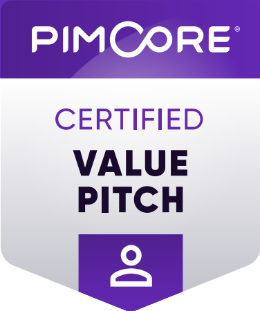

## Hi there, I'm Henri

Doing casual coding on Pimcore and Shopware 6 related projects.

### Earned Achievements:

(Valid until: 14.02.2026)

(Valid until: 30.12.2026)

(Valid until: 30.12.2026)

(Valid until: 30.12.2026)

<!--
### Stats:

- 🔭 I’m currently working on ...
- 🌱 I’m currently learning ...
- 👯 I’m looking to collaborate on ...
- 🤔 I’m looking for help with ...
- 💬 Ask me about ...
- 📫 How to reach me: ...
- 😄 Pronouns: ...
- ⚡ Fun fact: ...
-->
